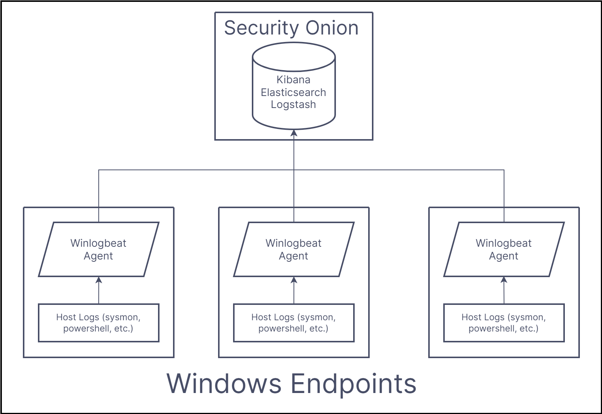

# Winlogbeat Installation with PowerShell

## Installing Winlogbeat Agents on Windows 10 Endpoints

## What is it

Our Security Onion is configured to read network and host logs into the ELK (elasticsearch, logstash, kibana) software stack on the Security Onion box. `Winlogbeat` is a windows log aggregation service built by elastic to send windows logs to the ELK stack in Security Onion.



We have `Winlogbeat` agents installed on each windows 10 machine on the network. There is a service configured to run on startup called `winlogbeat`. The data for the service is stored in `C:\ProgramData\Elastic\Beats\winlogbeat\`.

## Installing the agents

### 1. Downoad and run Winlogbeat installer

Winlogbeat has an msi installer to install the agent on a windows computer. You can download the installer from https://www.elastic.co/downloads/beats/winlogbeat, and run it on the target endpoint.

### 2. Change the Outputs from Elasticsearch to Logstash

The default installation of winlogbeat has some incorrect settings in its configuration file, `winlogbeat.yml` for Security Onion **(winlogbeat is automatically setup to run with the default configuration of ELK stack, not the confguration Security Onion uses)**. To properly modify the configuration file for Security Onion, the following changes have to be made:

Comment out the following lines in the Elasticsearch Output section: 
*     output.elasticsearch:
*     hosts: ["127.0.0.1:9200"]

Uncomment the following lines:
*     output.logstash
*     hosts ["127.0.0.1:5044"]

### 3. Change the target IP of Logstash to Security Onion Box

Change the Logstash hosts line in the Logstash Output section:
*     hosts: ["127.0.0.1:5044"] --> hosts: ["<IP_SECURITY_ONION>:5044"]

### 4. Move configuration file to correct directory

Name the modified file `winlogbeat.yml` and store in at `C:\ProgramData\Elastic\Beats\winlogbeat\winlogbeat.yml`.

### 5. Start the Winlogbeat service

In powershell, run the following command:

```powershell
PS> Start-Service winlogbeat
```

### 6. Configured Security Onion

Finally, your Security Onion Firewall must be configured to allow access from the windows machines with winlogbeat running. On your security onion console, set the following firewall configuration:

```
$ sudo so-allow
```

You will get a list of rules to modify, select `b` for Logstash endpoint

```
$ b
```

When prompted, add the range of IP addresses you wish to allow

```
$ 172.20.0.0/16
```

## Network Distribution

### Enable WinRM

To install the winlogbeat agents across the network without internet access, we used powershell scripting to move the installer and configuration file across the network. To do this, we needed to enable `WinRM` to use remote powershell sessions. This can be done in a few different ways (sourced from ([https://adamtheautomator.com/enable-psremoting/):

#### 1. Locally with PowerShell

To enable WinRM on a local computer, simply execute the following command in PowerShell:
```powershell
PS> Enable-PSRemoting -Force
```

#### 2. With a PowerShell CimSession from a Domain Admin

You can use the CimSession tool to spawn a powershell instance on a remote system, and use that powershell instance to run `Enable-PSRemoting`. The script looks like this:

```powershell
$SessionArgs = @{
        ComputerName = <HOSTNAME or IP>
        Credential = Get-Credential
        SessionOption = New-CimSessionOption -Protocol Dcom
    }

    $MethodArgs = @{
        ClassName = 'Win32_Process'
        MethodName = 'Create'
        CimSession = New-CimSession @SessionArgs
        Arguments = @{
            CommandLine = "powershell Start-Process [pwershell -ArgumentList 'Enable-PSRemoting -Force'"
        }
    }

    Invoke-CimMethod @MethodArgs
```

* The [enable_psremoting_network.ps1](enable_psremoting_network.ps1) script runs this command for a list of hosts in a CSV file. Make sure the first line of the CSV file defines the column with hostnames as `TargetHost`:

```csv
TargetHost,XYZ,XYZ,...
hostname01,XYZ,XYZ,...
hostname01,XYZ,XYZ,...
...
```

* Run the [enable_psremoting_network.ps1](enable_psremoting_network.ps1) script like this:
```powershell
PS> .\enable_psremoting.ps1 .\hosts.csv
```

#### 3. With Group Policy (better option if targeting entire network)

* Many tutorials out there, we used: https://www.youtube.com/watch?v=zVMGal0MpSA
* Once configured, you can push the group policy out to all computers on the network from the Domain Controller (or any machine with GPMC)


### Install winlogbeat agent via PowerShell

This repository contains a PowerShell scripts that run through the above installation process for either a single host or a CSV file of hosts.

#### 1. Via PowerShell

**Make sure `winlogbeat.yml` and `winlogbeat-8.2.2-windows-x86_64.msi` must be in `C:\` directory.**

```powershell
PS> .\install_winlogbeat_network.ps1 .\hosts.csv
```

#### 2. Via Group Policy

I have not had success doing this yet, but ideally this can be configred through group policy as well. See this article for details: https://mikebosland.com/installing-and-configuring-active-directory-with-powershell/

## Debugging Bad Sessions

If a windows endpoint is not sending logs to Security Onion, ensure that all of the following are true:

* Ensure `sysmon` service is running and windows logs are being collected in event viewer
    * In event viewer: `Application and Services Logs > Microsoft > Windows > Sysmon`
* Ensure `winlogbeat` service is running (Listed as `Elastic Winlogbeat 8.2.2` in `services.msc`)
* Ensure `C:\ProgramData\Elastic\winlogbeat\winlogbeat.yml` is properly configured with the above steps and in the correct directory

### Network Debugging

To see if WinRM is properly enabled and the winlogbeat service is running on a list of hosts, use the [check_status_network.ps1](check_status_network.ps1) script with a list of hosts.

```powershell
PS> .\check_status_network.ps1 .\hosts.csv
```